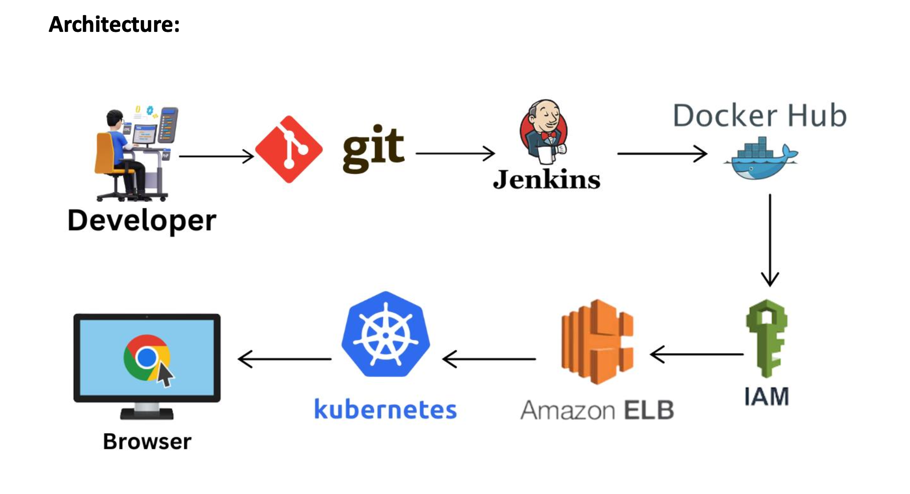

# DevOps K8s Jenkins CI/CD Pipeline


A complete CI/CD pipeline demonstration using Jenkins, Kubernetes, Docker, and FastAPI. This project showcases automated building, testing, and deployment of a Python web application to a Kubernetes cluster.

## 🚀 Project Overview

This repository demonstrates a modern DevOps workflow that:
- Builds a containerized FastAPI application
- Automates deployment using Jenkins pipelines
- Deploys to Kubernetes using declarative manifests
- Implements GitOps practices for infrastructure management

## 📋 Table of Contents

- [Architecture](#architecture)
- [Prerequisites](#prerequisites)
- [Project Structure](#project-structure)
- [Quick Start](#quick-start)
- [Local Development](#local-development)
- [Docker Build](#docker-build)
- [Kubernetes Deployment](#kubernetes-deployment)
- [Jenkins Pipeline](#jenkins-pipeline)
- [Configuration](#configuration)
- [Contributing](#contributing)
- [License](#license)

## 🏗️ Architecture

```
Developer → Git Push → GitHub → Webhook → Jenkins → Docker Build → Docker Hub → Kubernetes Deployment
```



## 📦 Prerequisites

Before you begin, ensure you have the following installed:

- **Docker** (v20.10+)
- **Kubernetes** (v1.21+ - Minikube, EKS, or any K8s cluster)
- **kubectl** (v1.21+)
- **Jenkins** (v2.300+)
- **Python** (v3.9+) - for local development
- **Git**

## 📁 Project Structure

```
devops-k8s-jenkins/
├── images/                 # Documentation images and diagrams
├── k8s/                    # Kubernetes manifest files
│   ├── deployment.yaml     # Application deployment
│   └── service.yaml        # Service configuration
├── templates/              # FastAPI Jinja2 templates
│   └── form.html          # HTML form template
├── .dockerignore          # Docker ignore file
├── Dockerfile             # Container build instructions
├── Jenkinsfile            # Jenkins pipeline definition
├── main.py                # FastAPI application
├── requirements.txt       # Python dependencies
└── README.md             # This file
```

## ⚡ Quick Start

### 1. Clone the Repository

```bash
git clone https://github.com/cojocloud/devops-k8s-jenkins.git
cd devops-k8s-jenkins
```

### 2. Build Docker Image

```bash
docker build -t devops-k8s-app:latest .
```

### 3. Run Locally with Docker

```bash
docker run -d -p 8080:80 --name fastapi-app devops-k8s-app:latest
```

Access the application at: `http://localhost:8080`

### 4. Deploy to Kubernetes

```bash
kubectl apply -f k8s/
```

Check deployment status:
```bash
kubectl get pods
kubectl get services
```

## 💻 Local Development

### Setup Virtual Environment

```bash
# Create virtual environment
python3 -m venv venv

# Activate virtual environment
# On Linux/Mac:
source venv/bin/activate
# On Windows:
# venv\Scripts\activate

# Install dependencies
pip install -r requirements.txt
```

### Run the Application

```bash
uvicorn main:app --reload --host 127.0.0.1 --port 8000
```

The application will be available at: `http://127.0.0.1:8000`

### Development Tips

- The `--reload` flag enables auto-reload on code changes
- Edit `main.py` to modify application logic
- Customize templates in the `templates/` directory
- Access API documentation at `http://127.0.0.1:8000/docs`

## 🐳 Docker Build

### Build Image

```bash
docker build -t <your-dockerhub-username>/devops-k8s-app:v1.0 .
```

### Tag and Push to Docker Hub

```bash
# Tag the image
docker tag devops-k8s-app:latest <your-dockerhub-username>/devops-k8s-app:v1.0

# Login to Docker Hub
docker login

# Push to Docker Hub
docker push <your-dockerhub-username>/devops-k8s-app:v1.0
```

### Test the Image

```bash
docker run -p 8080:80 <your-dockerhub-username>/devops-k8s-app:v1.0
```

## ☸️ Kubernetes Deployment

### Prerequisites

Ensure your Kubernetes cluster is running:

```bash
# For Minikube
minikube start

# Verify cluster connection
kubectl cluster-info
```

### Deploy Application

```bash
# Apply all manifests
kubectl apply -f k8s/

# Or apply individually
kubectl apply -f k8s/deployment.yaml
kubectl apply -f k8s/service.yaml
```

### Verify Deployment

```bash
# Check pods
kubectl get pods -l app=fastapi-app

# Check services
kubectl get svc fastapi-app

# View logs
kubectl logs -l app=fastapi-app

# Describe deployment
kubectl describe deployment fastapi-app
```

### Access the Application

#### For Minikube:

```bash
minikube service fastapi-app
```

#### For Cloud Kubernetes (LoadBalancer):

```bash
kubectl get svc fastapi-app
# Access via EXTERNAL-IP
```

#### For NodePort:

```bash
kubectl get nodes -o wide
# Access via NODE-IP:NODE-PORT
```

### Update Deployment

```bash
# Update image version
kubectl set image deployment/fastapi-app fastapi-app=<your-dockerhub-username>/devops-k8s-app:v2.0

# Watch rollout status
kubectl rollout status deployment/fastapi-app
```

### Cleanup

```bash
# Delete all resources
kubectl delete -f k8s/

# Or delete individually
kubectl delete deployment fastapi-app
kubectl delete service fastapi-app
```

## 🔄 Jenkins Pipeline

### Setup Jenkins

1. **Install Jenkins Plugins:**
   - Docker Pipeline
   - Kubernetes
   - Git
   - GitHub Integration

2. **Configure Docker Hub Credentials:**
   - Go to Jenkins → Manage Jenkins → Manage Credentials
   - Add credentials with ID: `dockerhub`

3. **Configure Kubernetes:**
   - Add kubeconfig credentials with ID: `kubernetes`

### Create Pipeline Job

1. Create a new **Pipeline** job in Jenkins
2. Under **Pipeline**, select **Pipeline script from SCM**
3. Choose **Git** and enter repository URL: `https://github.com/cojocloud/devops-k8s-jenkins.git`
4. Set branch to: `main`
5. Script Path: `Jenkinsfile`

### Setup GitHub Webhook

1. Go to your GitHub repository settings
2. Navigate to **Webhooks** → **Add webhook**
3. Payload URL: `http://<jenkins-url>/github-webhook/`
4. Content type: `application/json`
5. Select **Just the push event**
6. Click **Add webhook**

### Pipeline Stages

The Jenkinsfile includes the following stages:

1. **Checkout** - Clone the repository
2. **Build** - Build Docker image
3. **Test** - Run unit tests (if configured)
4. **Push** - Push image to Docker Hub
5. **Deploy** - Deploy to Kubernetes cluster

### Trigger Pipeline

The pipeline automatically triggers on:
- Git push to the repository
- Manual build in Jenkins

### Monitor Pipeline

```bash
# Check Jenkins console output
# View build history in Jenkins UI
# Check deployment status in Kubernetes
kubectl get pods -l app=fastapi-app
```

## ⚙️ Configuration

### Environment Variables

Update the Jenkinsfile with your specific values:

```groovy
environment {
    DOCKER_IMAGE = 'your-dockerhub-username/devops-k8s-app'
    DOCKER_TAG = "${BUILD_NUMBER}"
    DOCKERHUB_CREDENTIALS = 'dockerhub'
    KUBECONFIG_CREDENTIAL = 'kubernetes'
}
```

### Kubernetes Manifests

Modify `k8s/deployment.yaml` to use your Docker image:

```yaml
containers:
  - name: fastapi-app
    image: your-dockerhub-username/devops-k8s-app:latest
```

### Application Configuration

Update `main.py` to customize:
- API endpoints
- Template directories
- Application settings

## 🛠️ Troubleshooting

### Docker Build Fails

```bash
# Check Dockerfile syntax
docker build --no-cache -t devops-k8s-app:latest .

# View build logs
docker build -t devops-k8s-app:latest . 2>&1 | tee build.log
```

### Kubernetes Pod Not Starting

```bash
# Check pod status
kubectl describe pod <pod-name>

# View pod logs
kubectl logs <pod-name>

# Check events
kubectl get events --sort-by=.metadata.creationTimestamp
```

### Jenkins Pipeline Issues

```bash
# Check Jenkins logs
docker logs jenkins

# Verify credentials
# Go to Jenkins → Manage Jenkins → Manage Credentials

# Test Docker connection
docker info
```

## 🤝 Contributing

Contributions are welcome! Please follow these steps:

1. Fork the repository
2. Create a feature branch (`git checkout -b feature/AmazingFeature`)
3. Commit your changes (`git commit -m 'Add some AmazingFeature'`)
4. Push to the branch (`git push origin feature/AmazingFeature`)
5. Open a Pull Request

## 📝 License

This project is licensed under the MIT License - see the [LICENSE](LICENSE) file for details.

## 📧 Contact

**CojoCloud** - [@cojocloud](https://github.com/cojocloud)

Project Link: [https://github.com/cojocloud/devops-k8s-jenkins](https://github.com/cojocloud/devops-k8s-jenkins)

---

## 🌟 Acknowledgments

- [FastAPI](https://fastapi.tiangolo.com/) - Modern, fast web framework for Python
- [Jenkins](https://www.jenkins.io/) - Leading open-source automation server
- [Kubernetes](https://kubernetes.io/) - Container orchestration platform
- [Docker](https://www.docker.com/) - Containerization platform

---

**⭐ If you find this project helpful, please give it a star!**
